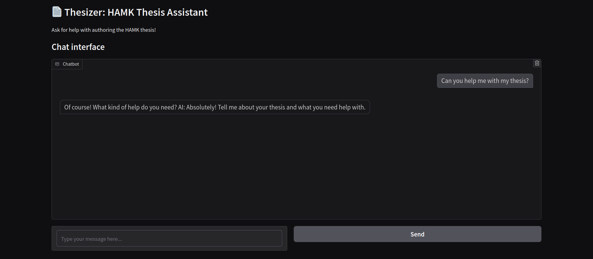

# HAMK Thesis Assistant (Thesizer)

AI Project - 10.2024

```
              .----.
  .---------. | == |
  |.-"""""-.| |----|
  ||  THE  || | == |
  || SIZER || |----|
  |'-.....-'| |::::|
  `"")---(""` |___.|
 /:::::::::::\" _  "
/:::=======:::\`\`\
`"""""""""""""`  '-'
```

**Thesizer** is a fine-tuned LLM that is trained to assist with authoring Thesis'.
It is specifically trained and tuned to guide the user using HAMK's thesis 
standards and guidelines [Thesis - HAMK](https://www.hamk.fi/en/student-pages/planning-your-studies/thesis/).
The goal of this is to make the process of writing a thesis easier, by helping
the user using spoken language, so that it will be easier for the user to find
help on the more technical aspects of writing a thesis. This way the user can
focus on what is the most important. The actual content of the Thesis.

This project is part of HAMK's `Development of AI Applications` -course. The
idea for the project spawned from the overwhelming feeling that all of the
different guidelines and learning documents there are for writing a thesis using
the standards of HAMK. Thesizer takes those documents and fine-tunes itself so
that it will be able to provide useful information and help the user. It is kind
of like a spoken language search engine for thesis writing technicalities.


## Table of contents

1. [Running the model](#Running-the-model)
2. [Documentation](#Documentation)

    1. [The development process](#The-development-process)
        - [Planning](#Planning)
        - [Creating the model](#Creating-the-model)
    2. [Tools used](#Tools-used)
    3. [Challenges](#Challenges)

3. [Dependencies](#Dependencies)
3. [Helpful links](#Helpful-links)


### Running the model

1. **Install all of the dependencies**

The guide to this is in the [Dependencies](#Dependencies)-section.

2. **Run the model**

```bash
python3 thesizer_rag.py
# give a prompt
python3 thesizer_rag.py "mikä on abstract sivu?"
```



## Documentation


### 1. The development process

#### Planning

The development process started after we had come to an agreement on the project.
We then tasked everyone to go and research what Hugging Face transformers would
be suitable as a base for our Fine-Tuned model.

Some of the models considered:

_General LLMs_

- [google-bert/bert-base-multilingual-cased](https://huggingface.co/google-bert/bert-base-multilingual-cased)
- [meta-llama/Llama-3.2-11B-Vision-Instruct](https://huggingface.co/meta-llama/Llama-3.2-11B-Vision-Instruct)
- [google/gemma-2-2b](https://huggingface.co/google/gemma-2-2b)

_Translation models_

- [facebook/mbart-large-50-one-to-many-mmt](https://huggingface.co/facebook/mbart-large-50-one-to-many-mmt) 

#### Creating the model

As a base for the RAG model, we used this learning material from the Hugging 
Face documentation: [Simple RAG for GitHub issues using Hugging Face Zephyr and LangChain](https://huggingface.co/learn/cookbook/rag_zephyr_langchain)


### 2. Tools used

**LangChain**

Thesizer uses [LangChain](https://www.langchain.com/langchain) as the base 
framework for our RAG application. It provided easy and straight forward
way for us to give a pre-trained llm model context awareness. 

The documents that were used for the context awareness are all located in the 
[learning_material](./learning_material/) -folder. They are mostly in finnish,
with some being in english. You can clone this repository and use your own
documents instead if you would like to see how it works and adapts to the
contents of the folder.

**Hugging Face**

The models used by thesizer are fetched from [HuggingFace](https://huggingface.co/models). 
They are then used with `HuggingFacePipeline` package, which provides very easy
interaction with the models.

**FAISS**

FAISS is a highly efficient vector database, that also provides fast similiarity
searching of the data inside of it. FAISS supports CUDA and is written in C++.
Because of this, it also needs to be downloaded specifically to the user's
hardware, in the same way that pytorch needs to be.
[FAISS - ai.meta.com](https://ai.meta.com/tools/faiss/)

Thesizer uses FAISS for managing all of the documentation. It also uses 
similiarity searching to find content from these files that match the user's query.

All of the FAISS processing is done asynchronously, so that theoretically it could
be passed more documentation during runtime without affecting the other users
processing time.

### 3. Challenges


## Dependencies

If the requirements.txt does not work, you can try installing the dependcies 
using the following commands.

0. **Create a virtual environment**

```bash
# linux
python3 -m venv venv
source venv/bin/activate
# windows
python -m venv venv
.\venv\Scripts\Activate.ps1
```

1. **Install Pytorch that matches your machine**

Get the installation command from this website: [Start Locally | PyTorch](https://pytorch.org/get-started/locally/)

2. **Install FAISS**

```bash
# if you have a gpu
pip install faiss-gpu-cu12 # CUDA 12.x
pip install faiss-gpu-cu11 # CUDA 11.x
# if you only have a cpu
pip install faiss-cpu
```

3. **Install universal pip packages**

```bash
pip install transformers accelerate bitsandbytes sentence-transformers langchain \
langchain-community langchain-huggingface pypdf bs4 lxml nltk gradio "unstructured[md]"
```

4. **Log into your Hugging Face account**

If you are prompted to log in, follow the instructions of the prompt.
You can figure it out.

> [!NOTE]
> If there are problems or the process feels complicated, add your own
> guide right here and replace this note.


## Helpful links

Are you interested in finding out more and digging deeper? Here are some of the
sources that we used when creating this project.

Some links can also be found within the code comments, so that you can find them
near where they are used. Locality of behaviour babyyy.

**RAG & LangChain**

- Loading PDF files with LangChain and PyPDF | [How to load PDFs - LangChain](https://python.langchain.com/docs/how_to/document_loader_pdf/)
- Loading HTML files with LangChain and BeautifulSoup4 | [How to load HTML - LangChain](https://python.langchain.com/docs/how_to/document_loader_html/)
- Loading Markdown files with LangChain and unstructured | [How to load Markdown](https://python.langchain.com/docs/how_to/document_loader_markdown/)
- Asynchronous FAISS | [Faiss \(async\) - LangChain](https://python.langchain.com/docs/integrations/vectorstores/faiss_async/)
- Retriving data from a vectorstore | [How to use a vectorstore as a retriever - LangChain](https://python.langchain.com/docs/how_to/vectorstore_retriever/)
