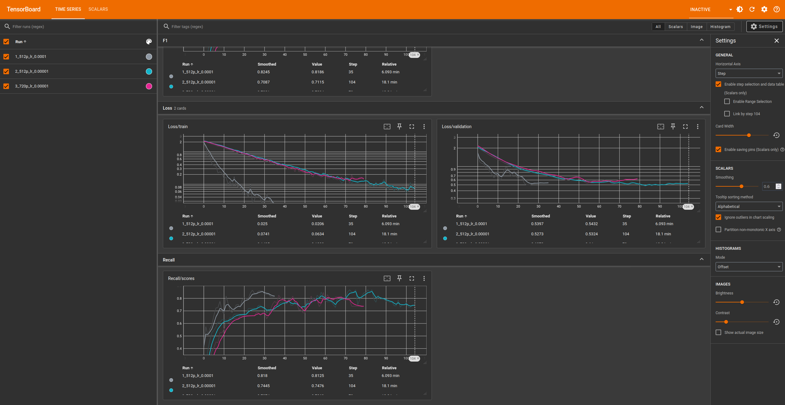
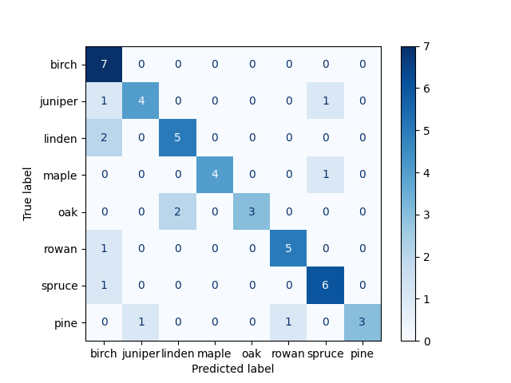

# Tree Recognition Project

```
     .\^/.
   . |`|/| .
   |\|\|'|/|
.--'-\`|/-''--.
 \`-._\|./.-'/
  >`-._|/.-'<
 '~|/~~|~~\|~'
       |
```

## Tree training data

The english names, finnish names and the amount of pictures taken.

- **Alder**: leppä (0)
- **Birch**: koivu (34)
- **Juniper**: kataja (29)
- **Linden**: lehmus (34)
- **Maple**: vaahtera (25)
- **Oak**: tammi (22)
- **Pine**: mänty (26)
- **Rowan**: pihlaja (35)
- **Spruce**: kuusi (25)

<hr>

**Overall**: 230 images

Video presentation of the project can be seen here: 
[Team Insiköörit - Tree Recognition Presentation ](https://www.youtube.com/watch?v=-E7X9wwAq2w)


## Table of contents

1. [Scores and results](#Scores-and-results)
    - [Confusion matrixes](#Confusion-matrixes)

2. [Running the project](#Running-the-project)
    - [Docker](#Docker)
    - [Bare-metal](#Bare-metal)

2. [Training the model](#Training-the-model)

3. [Helpful commands](#Helpful-commands)

5. [Dependencies](#Dependencies)

6. [Learning FastAPI](#Learning-FastAPI)


## Scores and results

The model turned out okay, with such a small window of time to develop it.

You can see the training and validation losses and accuracy, in graph form from
the `example_runs` directory. They also include the F1 and Recall scores.

To see these graphs, make sure that you have tensorboard installed and run the
following code in your terminal.

```bash
tensordboard --logdir=example_runs/
```

You can then head to the localhost port that the command gives you. In our testing
it seemed to be [localhost:6006](http://localhost:6006).

It will look like this, so feel free to look around for yourself.



### Confusion matrixes

1. **512x512px** images, with learning rate **0.0001**, running for about 40 epochs



2. **512x512px** images, with learning rate **0.00001**, running for about 100 epochs


3. **720x720px** images, with learning rate **0.00001**, running for about 80 epochs


## Running The Project

### Docker

The project can also be fetched from docker hub, so you don't have to build
everything yourself (building takes a long time). [sakuexe/insikoorit](https://hub.docker.com/repository/docker/sakuexe/insikoorit)

1. Add your own weights

This is done by making a folder inside this folder named `weights`.
After that you put your weights in there.

2. Run the containers

```bash
docker compose up
```


### Bare-metal

1. Set up the virtual environment

> [!NOTE]
> If you make a venv directory with a custom name,
> remember to add it into the .gitignore file!

```bash
# linux / wsl
python3 -m venv venv
source venv/bin/activate
# windows (powershell)
python -m venv venv
.\venv\Scripts\Activate.ps1
```

2. Install the required packages

```bash
pip install -r requirements.txt
```

3. Install pytorch to your virutal environment based on your specs

[Pytorch - Get Started Locally](https://pytorch.org/get-started/locally/)

4. Run the Web App

```bash
fastapi dev app/main.py
```


## Training the model

1. Train the model

```bash
python3 train_model.py
# see all the possible arguments
python3 train_model.py --help
```

2. Read the data of the runs

```bash
tensorboard --logdir=runs/
# open the link that the command prints
```

## Helpful commands

Re-preprocess the training images:

```bash
# linux
python3 image_preprocessing.py
# windows
python image_preprocessing.py
```

Find the number of images in total:

```bash
# linux
find tree_recognition/images/ -mindepth 2 -maxdepth 2 | wc -l
# windows (powershell)
Get-ChildItem -Path tree_recognition/images/ -Directory | ForEach-Object {$sum += (Get-ChildItem -Path $_.FullName | Measure-Object).Count} | Write-Host $sum
```

Reshuffle the tree images

```bash
# remove the image folders
rm -rf trees_training/ trees_valuation/
# get the base image folder
git checkout 047d5f0977f23ee910fe20e903eb45c8c1d78b68 -- trees_training
# run the python script
python3 organize_training.py
# commit and push your reshuffle
```


## Dependencies

The requirements.txt will fail if you are on Windows, so just in case, here is
the list of the required packages for this project. You install these manually
with the command below.

```bash
pip install matplotlib pillow tensorboard torchsummary "fastapi[standard]"
```

You also need to install pytorch. You can get the right command for your machine
from the following link: [Start Locally | PyTorch](https://pytorch.org/get-started/locally/)

- matplotlib - for visualizing data from the model training process

- pillow - needed for manipulating the images in preprocessing as well as during
the start of the training process

- tensorboard - for logging and visualizing the training process

- torchsummary - for summarizing the model

- fastapi - the web framework powering the web application

- pytorch - the main workhorse of the project


## Learning FastAPI

This part is meant for the group to get started with using FastAPI, since not
everyone has prior experience with it or many other web frameworks.

**Getting started with FastAPI basics:**

- [Tutorial - User Guide](https://fastapi.tiangolo.com/tutorial/)

**Using Templates with FastAPI (The frontend code):**

- [Learn - Templates](https://fastapi.tiangolo.com/advanced/templates/)
- [Eric Roby - FastAPI with Jinja2 in UNDER 6 minutes](https://www.youtube.com/watch?v=92iCfXAK0Gc)

> [!NOTE]
> All of the packages that are needed by these tutorials are already inside
> `requirements.txt`. Install them using `pip install -r requirements`!
> Therefore, you don't need to follow the installation steps in the tutorials.

**More in depth tutorial about using FastAPI (very optional, if interested)**

I chose this one because I thought that it was [Petri Kuittinen](https://github.com/petrikuittinen)
(the legend) in the thumbnail at first.

- [Travis Media - Why You NEED To Learn FastAPI | Hands On Project](https://www.youtube.com/watch?v=cbASjoZZGIw)
